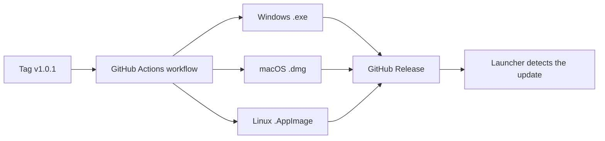

<div align="center">


# OpenMC — Community Minecraft Launcher

**The simple, fast and free launcher to play on your favorite Minecraft server.**

[](https://github.com/youtsuhodev/OpenMC/releases)
[](https://github.com/youtsuhodev/OpenMC/actions)
[](LICENSE)
[](https://github.com/youtsuhodev/OpenMC/releases)

</div>

---

## Table of Contents

- [About](#-about)
- [Features](#-features)
- [Installation](#-installation)
- [Usage](#-usage)
- [Build from Source](#-build-from-source)
- [Creating a Release](#-creating-a-release)
- [Configuration](#-configuration)
- [Project Structure](#-project-structure)
- [Troubleshooting](#-troubleshooting)
- [Contributing](#-contributing)
- [License](#-license)

---

## ✦ About

**OpenMC** is a **cracked** (offline mode) launcher for Minecraft Java. Enter a username, pick your RAM and version, hit **Play**: the game downloads, launches and automatically connects to the configured server.

| Feature | Value |
| :--- | :--- |
| Authentication | Username (offline) |
| Supported versions | Recent vanilla (latest release auto-detected) |
| Java runtime | Java 25 downloaded automatically when missing |
| Download | Automatic (Mojang + libraries + assets) |
| Updates | Automatic via GitHub Releases |

> **Note** : OpenMC is **not affiliated with Mojang AB or Microsoft**. Minecraft is a trademark of Mojang AB.

---

## ✦ Features

- **One-click launch** — automatic download and server connection
- **Offline (cracked) mode** — play with any username
- **Smart Java 25 download** when no compatible installation exists
- **RAM management** — slider from 2 to 16 GB
- **Version picker** — latest release or a specific version
- **Real-time progress** — download status and progress bar
- **Discord Rich Presence** — "Playing OpenMC" on your profile
- **Auto-update** — updates detected and installed automatically
- **Custom wallpaper** — choose your own background image
- **News feed** — configurable remote feed
- **Cross-platform** — Windows, macOS, Linux
- **Full installer** — NSIS wizard with image, license and steps

### Screens

| Home | Settings | News |
| :---: | :---: | :---: |
| Username + Play + RAM | RAM, resolution, Java, JVM | News feed |

---

## ✦ Installation

Download the latest installer from the **[Releases](https://github.com/youtsuhodev/OpenMC/releases)** page.

| Platform | File | Install |
| :--- | :--- | :--- |
| **Windows** | `OpenMC Setup <version>.exe` | Follow the wizard (image, license, folder) |
| **macOS** | `OpenMC-<version>.dmg` | Drag the app into Applications |
| **Linux** | `OpenMC-<version>.AppImage` | `chmod +x` then run |

> **Windows** : the installer is not signed. If a blue screen appears, click
> **More info → Run anyway**.

---

## ✦ Usage

1. Launch **OpenMC**.
2. Enter your **username** (3 to 16 chars, letters/digits/`_`).
3. Pick your **version** and **RAM**.
4. Click **Play**.
5. The game downloads (first time), launches and joins the server automatically.

> **Tip** : if the server uses AuthMe, register in-game with `/register <password> <password>`.

---

## ✦ Build from Source

### Prerequisites

- [Node.js](https://nodejs.org) 20 or later
- npm 10+

### Steps

```bash
# 1. Clone the repository
git clone https://github.com/youtsuhodev/OpenMC.git
cd OpenMC

# 2. Install dependencies
npm install

# 3. Run in development mode (hot-reload UI)
npm run dev

# 4. Production build
npm run build
npm start
```

### Useful Commands

| Command | Description |
| :--- | :--- |
| `npm run dev` | Run the launcher in development mode |
| `npm run build` | Build main process + renderer |
| `npm run lint` | Lint the code (ESLint) |
| `npm run typecheck` | TypeScript type checking |
| `npm run dist` | Build the Windows installer |
| `npm run dist:mac` | Build the macOS installer |
| `npm run dist:linux` | Build the Linux AppImage |

---

## ✦ Creating a Release

A **GitHub Actions workflow** automatically builds and publishes all installers.

```bash
git tag v1.0.1
git push origin v1.0.1
```

What happens next :



- The version is read from the tag (`v1.0.1` → `1.0.1`).
- The `latest*.yml` files are published for **auto-update**.
- The installers are also uploaded as *artifacts*.

---

## ✦ Configuration

All settings live in `src/shared/constants.ts` :

| Constant | Role |
| :--- | :--- |
| `SERVER_IP` / `SERVER_PORT` | Default server address (empty = set in Settings) |
| `DISCORD_CLIENT_ID` | Public Discord application ID (Rich Presence) |
| `JAVA_MIN_VERSION` | Minimum required Java version |
| `ADOPTIUM_API` | Source used to download the Java runtime |

Players can also adjust from the UI (Settings) :

- Allocated RAM
- Game version
- Resolution and fullscreen
- Extra JVM arguments
- Server address
- Discord presence
- Wallpaper
- News feed URL

### News feed

Set the URL of a JSON like this in Settings :

```json
[
  {
    "title": "New season!",
    "date": "2026-08-12",
    "content": "Season 5 is open, come join us!"
  }
]
```

---

## ✦ Project Structure

```text
openmc-launcher/
├── .github/workflows/
│   └── build.yml              # Auto-build Win/macOS/Linux on v* tags
├── build/                     # Installer assets
│   ├── icon.png               # Application icon
│   ├── installerSidebar.bmp   # Wizard sidebar image
│   ├── installer.nsh          # Custom NSIS script
│   └── license.txt            # License page
├── src/
│   ├── main/                  # Electron main process
│   │   ├── index.ts           # Window, lifecycle
│   │   ├── ipc.ts             # IPC handlers
│   │   ├── launch.ts          # Game download & launch
│   │   ├── java.ts            # Java detection / download
│   │   ├── settings.ts        # Persisted settings
│   │   ├── news.ts            # News feed
│   │   ├── discord.ts         # Rich Presence (native IPC)
│   │   └── updates.ts         # Auto-update
│   ├── preload/               # Secure bridge (contextBridge)
│   ├── renderer/              # React UI
│   │   ├── components/        # PlayPanel, Settings, News, Toasts...
│   │   ├── App.tsx
│   │   └── styles.css
│   └── shared/                # Shared types & constants
├── scripts/
│   └── dev.mjs                # Development script
├── package.json
└── vite.config.mjs
```

### Tech Stack

| Technology | Usage |
| :--- | :--- |
| [Electron](https://www.electronjs.org) | Desktop framework |
| [React](https://react.dev) + [Vite](https://vitejs.dev) | User interface |
| [TypeScript](https://www.typescriptlang.org) | Language |
| [minecraft-launcher-core](https://www.npmjs.com/package/minecraft-launcher-core) | Game download & launch |
| [electron-builder](https://www.electron.build) | Packaging / installers |
| [Bootstrap Icons](https://icons.getbootstrap.com) | UI icons |

---

## ✦ Troubleshooting

| Problem | Solution |
| :--- | :--- |
| The game won't launch | Check your internet connection and allocated RAM |
| "Invalid username" | 3 to 16 chars, letters/digits/`_` only |
| The game closes on startup | Make sure you have a recent Java or let OpenMC download one |
| No server connection | Set the address in **Settings → Server address** |
| Windows blocks the installer | **More info → Run anyway** (unsigned installer) |
| Discord shows nothing | Enable Discord presence in Settings |

---

## ✦ Contributing

Contributions are welcome!

- [ ] Report a bug via an **issue**
- [ ] Suggest an improvement
- [ ] Open a **pull request**

```bash
# Recommended workflow
git checkout -b feature/my-feature
# ... your changes ...
npm run lint
npm run typecheck
npm run build
git push origin feature/my-feature
```

---

## ✦ License

Distributed under the **MIT** license. See the [LICENSE](LICENSE) file for details.

**Minecraft** and associated names belong to **Mojang AB / Microsoft**. This project is an independent community project with no official affiliation.

---

<div align="center">

**Built with passion for the Minecraft community.**

[Releases](https://github.com/youtsuhodev/OpenMC/releases) · [Issues](https://github.com/youtsuhodev/OpenMC/issues) · [Repository](https://github.com/youtsuhodev/OpenMC)

</div>
