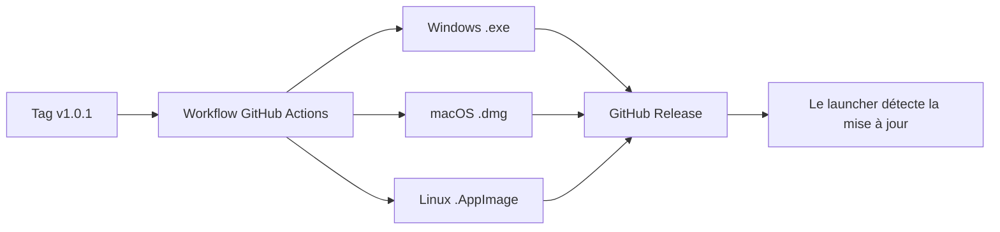

<div align="center">


# OpenMC — Launcher Minecraft communautaire

**Le launcher simple, rapide et gratuit pour jouer sur ton serveur Minecraft préféré.**

[](https://github.com/youtsuhodev/OpenMC/releases)
[](https://github.com/youtsuhodev/OpenMC/actions)
[](LICENSE)
[](https://github.com/youtsuhodev/OpenMC/releases)

</div>

---

## Table des matières

- [À propos](#-à-propos)
- [Fonctionnalités](#-fonctionnalités)
- [Installation](#-installation)
- [Utilisation](#-utilisation)
- [Compiler depuis les sources](#-compiler-depuis-les-sources)
- [Créer une version (release)](#-créer-une-version-release)
- [Configuration](#-configuration)
- [Structure du projet](#-structure-du-projet)
- [Dépannage](#-dépannage)
- [Contribution](#-contribution)
- [Licence](#-licence)

---

## ✦ À propos

**OpenMC** est un launcher **cracké** (mode hors ligne) pour Minecraft Java. Tu entres un pseudo, tu choisis ta RAM et ta version, tu cliques sur **Jouer** : le jeu se télécharge, se lance et se connecte automatiquement au serveur configuré.

| Caractéristique | Valeur |
| :--- | :--- |
| Authentification | Pseudo (hors ligne) |
| Versions supportées | Vanilla récentes (dernière release automatique) |
| Runtime Java | Java 25 téléchargé automatiquement si absent |
| Téléchargement | Auto (Mojang + librairies + ressources) |
| Mises à jour | Automatiques via GitHub Releases |

> **Note** : OpenMC n'est **pas affilié à Mojang AB ni à Microsoft**. Minecraft est une marque déposée de Mojang AB.

---

## ✦ Fonctionnalités

- **Lancement en 1 clic** — téléchargement et connexion automatique au serveur
- **Mode hors ligne (crack)** — joue avec n'importe quel pseudo
- **Téléchargement intelligent du Java 25** si aucune installation compatible
- **Gestion de la RAM** — curseur de 2 à 16 Go
- **Choix de la version** — dernière release ou version spécifique
- **Statut du launcher en temps réel** — progression des téléchargements
- **Discord Rich Presence** — « Joue sur OpenMC » sur ton profil
- **Auto-update** — mises à jour proposées et installées automatiquement
- **Fond d'écran personnalisable** — choisis ta propre image
- **Actualités** — flux distant configurable
- **Cross-platform** — Windows, macOS, Linux
- **Installeur complet** — assistant NSIS avec image, licence et étapes

### Écrans

| Accueil | Réglages | Actualités |
| :---: | :---: | :---: |
| Pseudo + Jouer + RAM | RAM, résolution, Java, JVM | Flux d'actualités |

---

## ✦ Installation

Télécharge le dernier installateur depuis la page **[Releases](https://github.com/youtsuhodev/OpenMC/releases)**.

| Plateforme | Fichier | Installation |
| :--- | :--- | :--- |
| **Windows** | `OpenMC Setup <version>.exe` | Suis l'assistant (image, licence, dossier) |
| **macOS** | `OpenMC-<version>.dmg` | Glisse l'app dans Applications |
| **Linux** | `OpenMC-<version>.AppImage` | `chmod +x` puis exécute |

> **Windows** : l'installeur n'est pas signé. Si un écran bleu apparaît, clique sur
> **Plus d'informations → Exécuter quand même**.

---

## ✦ Utilisation

1. Lance **OpenMC**.
2. Saisis ton **pseudo** (3 à 16 caractères, lettres/chiffres/`_`).
3. Choisis ta **version** et ta **RAM**.
4. Clique sur **Jouer**.
5. Le jeu se télécharge (première fois), se lance et rejoint le serveur automatiquement.

> **Astuce** : si tu joues sur un serveur avec AuthMe, enregistre-toi en jeu avec `/register <motdepasse> <motdepasse>`.

---

## ✦ Compiler depuis les sources

### Prérequis

- [Node.js](https://nodejs.org) 20 ou plus
- npm 10+

### Étapes

```bash
# 1. Cloner le dépôt
git clone https://github.com/youtsuhodev/OpenMC.git
cd OpenMC

# 2. Installer les dépendances
npm install

# 3. Lancer en développement (rechargement à chaud de l'UI)
npm run dev

# 4. Build de production
npm run build
npm start
```

### Commandes utiles

| Commande | Description |
| :--- | :--- |
| `npm run dev` | Lance le launcher en mode développement |
| `npm run build` | Compile le processus principal + l'interface |
| `npm run lint` | Vérifie le code (ESLint) |
| `npm run typecheck` | Vérifie les types TypeScript |
| `npm run dist` | Génère l'installeur Windows |
| `npm run dist:mac` | Génère l'installeur macOS |
| `npm run dist:linux` | Génère l'AppImage Linux |

---

## ✦ Créer une version (release)

Un **workflow GitHub Actions** construit et publie automatiquement les installateurs.

```bash
git tag v1.0.1
git push origin v1.0.1
```

Ce qui se passe ensuite :



- La version est lue depuis le tag (`v1.0.1` → `1.0.1`).
- Les fichiers `latest*.yml` sont publiés pour l'**auto-update**.
- Les installateurs sont aussi déposés en *artifacts*.

---

## ✦ Configuration

Toutes les valeurs de réglage se trouvent dans `src/shared/constants.ts` :

| Constante | Rôle |
| :--- | :--- |
| `SERVER_IP` / `SERVER_PORT` | Adresse du serveur par défaut (vide = à renseigner dans les Réglages) |
| `DISCORD_CLIENT_ID` | ID public de l'application Discord (Rich Presence) |
| `JAVA_MIN_VERSION` | Version Java minimale exigée |
| `ADOPTIUM_API` | Source de téléchargement du runtime Java |

Le joueur peut aussi ajuster depuis l'UI (Réglages) :

- RAM allouée
- Version du jeu
- Résolution et plein écran
- Arguments JVM supplémentaires
- Adresse du serveur
- Presence Discord
- Fond d'écran
- URL du flux d'actualités

### Flux d'actualités

Configure l'URL d'un JSON de ce type dans les Réglages :

```json
[
  {
    "title": "Nouvelle saison !",
    "date": "2026-08-12",
    "content": "La saison 5 est ouverte, rejoignez-nous !"
  }
]
```

---

## ✦ Structure du projet

```text
openmc-launcher/
├── .github/workflows/
│   └── build.yml              # Build auto Win/macOS/Linux sur tag v*
├── build/                     # Assets de l'installeur
│   ├── icon.png               # Icône de l'application
│   ├── installerSidebar.bmp   # Image latérale de l'assistant
│   ├── installer.nsh          # Script NSIS personnalisé
│   └── license.txt            # Page de licence
├── src/
│   ├── main/                  # Processus principal Electron
│   │   ├── index.ts           # Fenêtre, lifecycle
│   │   ├── ipc.ts             # Handlers IPC
│   │   ├── launch.ts          # Téléchargement & lancement du jeu
│   │   ├── java.ts            # Détection / téléchargement du Java
│   │   ├── settings.ts        # Réglages persistés
│   │   ├── news.ts            # Flux d'actualités
│   │   ├── discord.ts         # Rich Presence (IPC natif)
│   │   └── updates.ts         # Auto-update
│   ├── preload/               # Pont sécurisé (contextBridge)
│   ├── renderer/              # Interface React
│   │   ├── components/        # PlayPanel, Settings, News, Toasts...
│   │   ├── App.tsx
│   │   └── styles.css
│   └── shared/                # Types & constantes partagés
├── scripts/
│   └── dev.mjs                # Script de développement
├── package.json
└── vite.config.mjs
```

### Stack technique

| Technologie | Utilisation |
| :--- | :--- |
| [Electron](https://www.electronjs.org) | Framework desktop |
| [React](https://react.dev) + [Vite](https://vitejs.dev) | Interface utilisateur |
| [TypeScript](https://www.typescriptlang.org) | Langage |
| [minecraft-launcher-core](https://www.npmjs.com/package/minecraft-launcher-core) | Téléchargement & lancement du jeu |
| [electron-builder](https://www.electron.build) | Packaging / installeurs |
| [Bootstrap Icons](https://icons.getbootstrap.com) | Icônes de l'interface |

---

## ✦ Dépannage

| Problème | Solution |
| :--- | :--- |
| Le jeu ne se lance pas | Vérifie la connexion internet et ta RAM allouée |
| « Pseudo invalide » | 3 à 16 caractères, lettres/chiffres/`_` uniquement |
| Le jeu se ferme au démarrage | Assure-toi d'avoir une version de Java récente ou laisse OpenMC en télécharger une |
| Pas de connexion au serveur | Renseigne l'adresse dans **Réglages → Adresse du serveur** |
| Windows bloque l'installation | **Plus d'informations → Exécuter quand même** (installateur non signé) |
| Discord : rien ne s'affiche | Active la Presence Discord dans les Réglages |

---

## ✦ Contribution

Les contributions sont les bienvenues !

- [ ] Signale un bug via une **issue**
- [ ] Propose une amélioration
- [ ] Ouvre une **pull request**

```bash
# Workflow recommandé
git checkout -b feature/ma-fonctionnalite
# ... tes modifications ...
npm run lint
npm run typecheck
npm run build
git push origin feature/ma-fonctionnalite
```

---

## ✦ Licence

Distribué sous licence **MIT**. Voir le fichier [LICENSE](LICENSE) pour plus d'informations.

**Minecraft** et les noms associés appartiennent à **Mojang AB / Microsoft**. Ce projet est un projet communautaire indépendant, sans affiliation officielle.

---

<div align="center">

**Fait avec passion pour la communauté Minecraft.**

[Releases](https://github.com/youtsuhodev/OpenMC/releases) · [Issues](https://github.com/youtsuhodev/OpenMC/issues) · [Dépôt](https://github.com/youtsuhodev/OpenMC)

</div>
